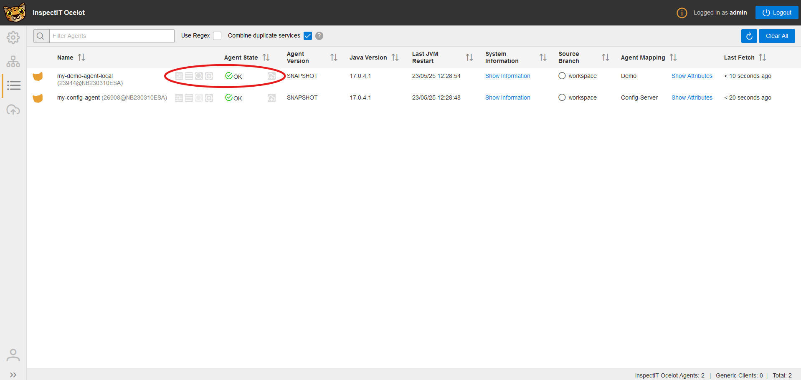

Here is a short guide to help you navigate around the status table.

#### Marked Buttons explained
-  Here the current services (e.g. Prometheus, Jaeger, Influx, Log-Preloading, Agent Command Service, ...) and their current state enabled/disabled are being displayed.  
In the future it should be as easy as pressing a button to enable/disable a service.

-  When the agent commands and the log preloading are activated, the logs of the service are being shown here.

-  When the agent commands are activated, the current config in yaml format is being shown here.

-  When the agent commands and the log preloading are activated, you can download the support archive as a .zip file here, containing logs, config and environment details.